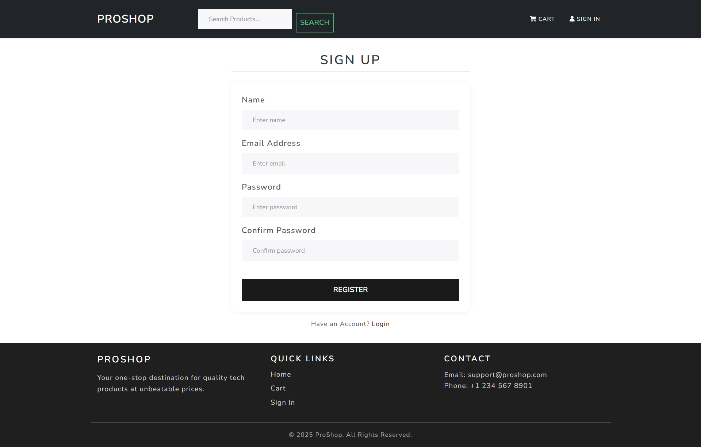
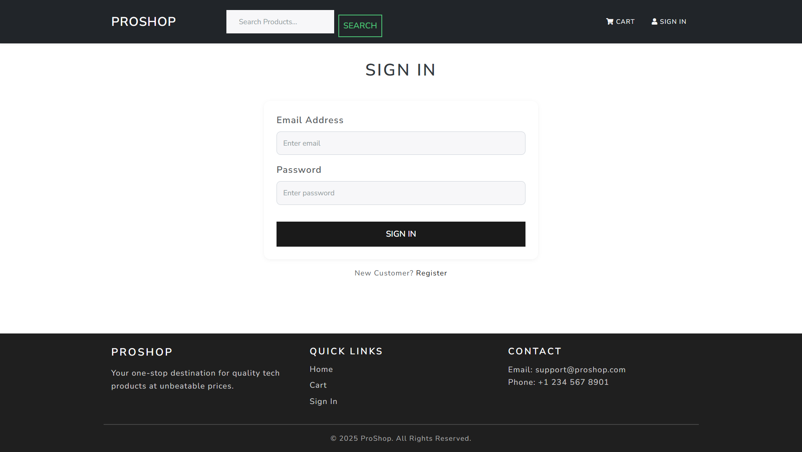
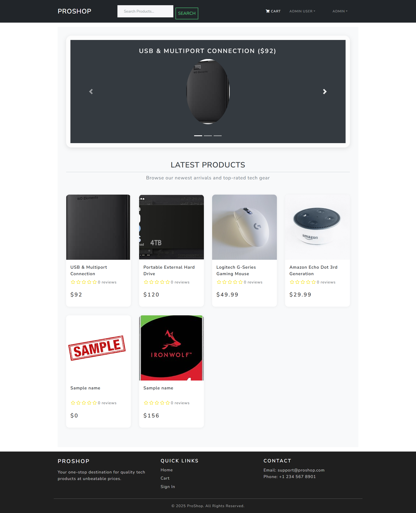
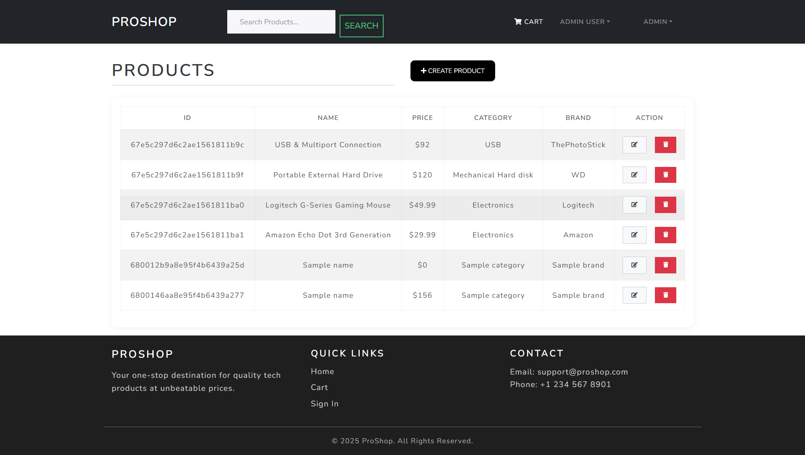
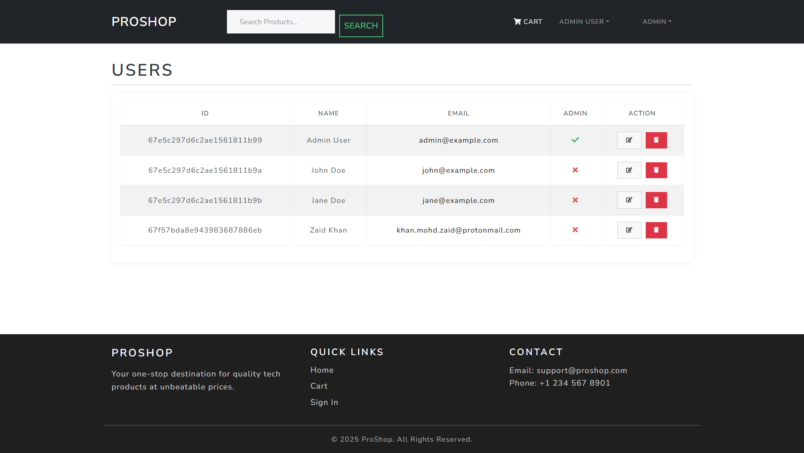
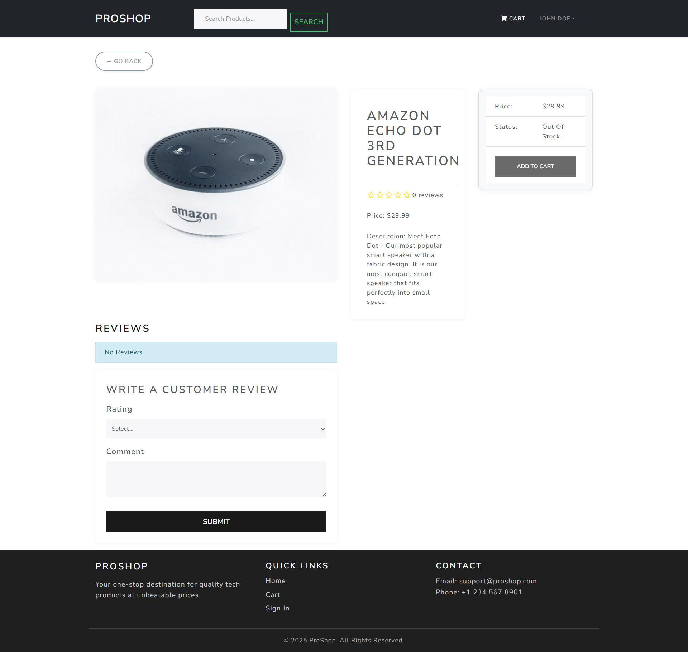
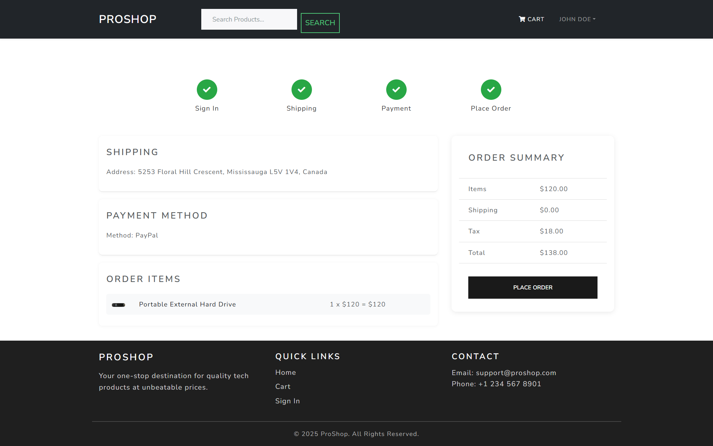

# 🛒 Computer Storage Devices eCommerce Platform

> A full-stack eCommerce application built with the **MERN stack** (MongoDB, Express.js, React.js, Node.js) designed for selling computer storage devices like HDDs and SSDs. Developed as part of the Full Stack JavaScript course (CSD 3103).

---

## 📦 Features

- 🔐 Role-based user authentication (Admin/Customer)
- 🏠 Product catalog with detailed view
- 🛒 Shopping cart and checkout flow
- ✍️ Product reviews and ratings
- 🧑‍💼 User profile and order history
- 🛠 Admin dashboard for product/user management
- 📦 Order tracking and status updates
- 💳 PayPal integration (or placeholder for payment flow)
- 📊 Database seeding for quick testing

---

## 🛠 Tech Stack

- **Frontend**: React.js, Bootstrap, vite.js
- **Backend**: Node.js, Express.js, JWT
- **Database**: MongoDB with Mongoose
- **State Management**: Redux
- **Authentication**: JSON Web Tokens (JWT)
- **Deployment**: (Optional) Vercel / Render / Heroku

---

## 🚀 Getting Started

### 📁 Clone the repo

git clone https://github.com/Gaurav2213/computer-storage-ecommerce-app.git

# step 1: 
Install Dependencies :

`npm install`

# step 2:
Run the App:

`npm run dev`

[ Frontend: http://localhost:3000]

[ Backend: http://localhost:5000]

# 🌱 Seed the Database
*npm run data:import   # to import sample users and products
npm run data:destroy  # to delete all data*

# Samples Login:

Admin:    admin@example.com / 123456
Customer: john@example.com / 123456

# 🧑‍💻Author & Course

Developed by Gaurav Sharma
Course: CSD 3103 - Full Stack JavaScript
Developed by Gaurav Sharma
Lambton College | Winter 2025

# 📸 Screenshots

Registartion Page:

Login Page:

Home Page:

Admin DashBoard:
;

User Management:

Product Page:

Cart Page:

